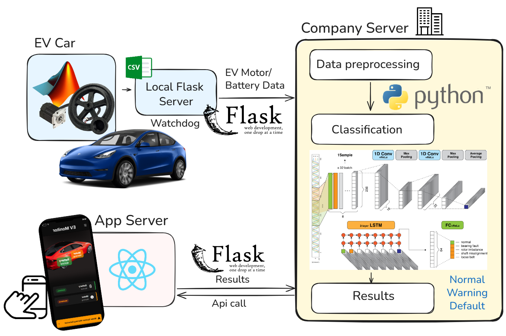

# Smart Fault Detection in Motor
**Project Date :** June 2025 

## Model
### Overview
This system performs motor fault diagnosis by analyzing time-series current data. A CNN-LSTM model is used for multi-class classification, where 1D CNN layers extract local spectral features and BiLSTM layers capture temporal dependencies across windows.

### Dataset

The motor dataset consists of three-phase current signals collected from industrial motors. It includes five fault categories: Normal, Rotor Unbalance, Bearing Fault, Loose Belt, and Sensor Fault.

[AI Hub motor fault detection dataset](https://aihub.or.kr/aihubdata/data/view.do?dataSetSn=238)

## Demo

### Concept
This repository includes an emulation-based EV fault detection system. Data is transmitted to a server for processing, and the diagnostic results are displayed through a mobile application.

### Emulation
A real-time demo system was implemented using a TI LAUNCHXL-F28379D controller and a PMSM motor. Rotor unbalance was simulated with 0g, 50g, and 100g attached weights.